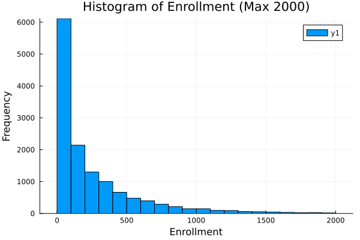
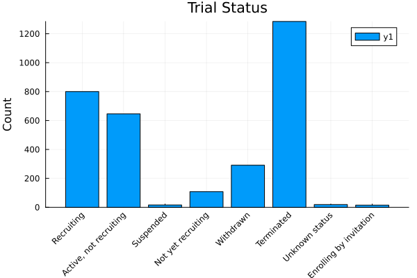
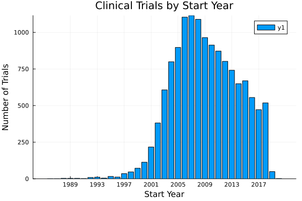
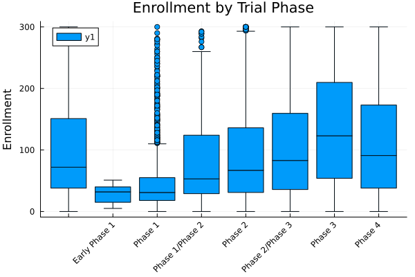

# Klinikai próbák Adatainak Elemzése

A program egy CSV fájlból származó klinikai próbák adatainak elemzésére szolgál. A szkript különböző Julia csomagokat használ az adatok kezelésére, statisztikai elemzésére és vizualizálására.

## Használt Csomagok
- CSV: CSV fájlok beolvasása DataFrame-ekbe.
- DataFrames: DataFrame-ek kezelése és elemzése.
- Statistics: Statisztikai függvények.
- StatsBase: Statisztikai függvények.
- Plots: Diagramok és vizualizációk készítése.
- StatsPlots: Statisztikai diagramok készítése.

## Függvények és Céljuk
1. `load_data(file_path)`

Ez a függvény beolvassa a megadott CSV fájlt és DataFrame-ként adja vissza.

```julia
function load_data(file_path)
    return CSV.read(file_path, DataFrame)
end
```
2. `display_basic_info(df)`

Ez a függvény megjeleníti a sorok, oszlopok számát és az oszlopok neveit.

```julia
function display_basic_info(df)
    println("Number of rows: ", nrow(df))
    println("Number of columns: ", ncol(df))
    println("Column names: ", names(df))
end
```
3. `display_summary_statistics(df)`

Ez a függvény megjeleníti a numerikus oszlopok összegző statisztikáit a DataFrame-ben.

```julia
function display_summary_statistics(df)
    println("Summary statistics for numeric columns:")
    println(describe(df))
end
```

4. `filter_by_enrollment(df, max_enrollment)`

Ez a függvény szűri a DataFrame-et, hogy csak olyan próbákat tartalmazzon, amelyek részvételi létszáma kisebb vagy egyenlő a megadott maximális létszámnál.

```julia
function filter_by_enrollment(df, max_enrollment)
    return filter(row -> row.Enrollment <= max_enrollment, df)
end
```

5. `plot_histogram(df, max_enrollment, num_bins, output_file)`

Ez a függvény hisztogramot készít a részvételi létszám adatokból, és elmenti a megadott fájlba.

```julia
function plot_histogram(df, max_enrollment, num_bins, output_file)
    enrollment_min = minimum(df.Enrollment)
    enrollment_max = maximum(df.Enrollment)
    bin_width = (enrollment_max - enrollment_min) / num_bins
    bin_edges = enrollment_min:bin_width:enrollment_max
    histogram(df.Enrollment, bins=bin_edges, xlabel="Enrollment", ylabel="Frequency", title="Histogram of Enrollment (Max $(max_enrollment))")
    savefig(output_file)
end
```



Jól látható, hogy a klinikai próbák résztvevőinek száma az esetek többségében kevesebb, mint 100. Ez részben köszöhető az ismeretek hiányának, hiszen nagyon kevesen ismerik egy klinikai próba folyamatát, illetve elenyésző esetben hallani részvételi lehetőségekről. 

6. `plot_trial_status(df, output_file)`

Ez a függvény oszlopdiagramot készít a próbák státuszáról, és elmenti a megadott fájlba.

```julia
function plot_trial_status(df, output_file)
    temporary_df = filter(row -> row.Status != "Completed", df)
    status_counts = StatsBase.countmap(temporary_df.Status)
    bar(collect(keys(status_counts)), collect(values(status_counts)), xlabel="Status", ylabel="Count", title="Trial Status", xticks=:auto, xrotation=45)
    savefig(output_file)
```



Kiszűröm a már véget ért próbákat, mivel több, mint 10.000 van belőlük ebben az adathalmazban.

7. `display_top_sponsors(df, top_n)`

Ez a függvény megjeleníti a legnagyobb szponzorokat a próbák száma alapján.

```julia
function display_top_sponsors(df, top_n)
    sponsor_counts = StatsBase.countmap(df.Sponsor)
    sorted_sponsors = sort(collect(sponsor_counts), by=x->x[2], rev=true)
    println("Top $(top_n) Sponsors:")
    for (sponsor, count) in sorted_sponsors[1:top_n]
        println("$sponsor: $count trials")
    end
end
```

8. `display_trial_phase_distribution(df)`

Ez a függvény megjeleníti a próbák fázis szerinti eloszlását.

```julia
function display_trial_phase_distribution(df)
    phase_counts = StatsBase.countmap(df.Phase)
    println("\nTrial Phase Distribution:")
    for (phase, count) in phase_counts
        println("$phase: $count trials")
    end
end
```

9. `plot_temporal_analysis(df, output_file)`

Ez a függvény oszlopdiagramot készít a próbák kezdési évének eloszlásáról, és elmenti a megadott fájlba.

```julia
function plot_temporal_analysis(df, output_file)
    start_year_counts = StatsBase.countmap(string.(df.Start_Year))
    sorted_years = sort(collect(keys(start_year_counts)), by=x->parse(Int, x))
    bar(sorted_years, [start_year_counts[year] for year in sorted_years], xlabel="Start Year", ylabel="Number of Trials", title="Clinical Trials by Start Year")
    savefig(output_file)
end
```



Az klinkai próbák többek között a szabályozottság kialakulása miatt a 2000-es évek után váltak egy hatalmas piaccá. Bár a grafikon a Covid-ot követő évekről nem tartalmaz információt, nyugodt lélekkel állíthatom, hogy erősen növekszik a klinikai próbák száma szűkebb jelenünkben is.

10. `analyze_summary_length(df)`

Ez a függvény elemzi az összefoglalók hosszát, és megjeleníti az átlagos hosszúságot.

```julia
function analyze_summary_length(df)
    df[!,:Summary_Length] = length.(df[:,:Summary])
    avg_summary_length = mean(df[:,:Summary_Length])
    println("\nAverage Summary Length: ", avg_summary_length)
end
```

11. `display_top_conditions(df, top_n)`

Ez a függvény megjeleníti a leggyakoribb betegségeket, amelyekre a próbákat végzik.

```julia
function display_top_conditions(df, top_n)
    condition_counts = StatsBase.countmap(df.Condition)
    sorted_conditions = sort(collect(condition_counts), by=x->x[2], rev=true)
    println("\nTop $(top_n) Conditions:")
    for (condition, count) in sorted_conditions[1:top_n]
        println("$condition: $count trials")
    end
end
```

12. `plot_enrollment_by_phase(df, output_file)`

Ez a függvény boxplotot készít a részvételi létszám adatokból a próbák fázisai szerint, és elmenti a megadott fájlba.

```julia
function plot_enrollment_by_phase(df, output_file)
    boxplot(df.Phase, df.Enrollment, xlabel="Phase", ylabel="Enrollment", title="Enrollment by Trial Phase", xticks=:auto, xrotation=45)
    savefig(output_file)
end
```



Ezt az ábrát maximum 300 fős létszámú próbákra készítettem el, hogy értelmezhető formát öltsön. A Phase 1-es próbák zöme kevesebb, mint 150 fővel zajlik. Ennek magyarázata, hogy Phase 1 résztvevőinek nem lehetnek más betegségei, mint amelyet éppen vizsgálnak. Ez egy viszonylag kockázatos fázis még, mivel ekkor próbálják felderíteni a kritikusan magas dózis határát. Az ennél is korábbi Early Phase 1-nek nagyon nem is látszik, hogy lenne felfelé kiugró értéke, mivel ekkor összességében azt próbálják vizsgálni, hogy a gyógyszer veszélyes-e akármilyen dózisban az emberi szervezetre.

## Futtatás
Ez a szekció végrehajtja a fent definiált függvényeket az adatok betöltésére, elemzésére és vizualizálására.

```julia
df = load_data("clinical_trials.csv")
display_basic_info(df)
display_summary_statistics(df)

max_enrollment = 2000
filtered_df = filter_by_enrollment(df, max_enrollment)
plot_histogram(filtered_df, max_enrollment, 20, "histogram_enrollment_max.png")
plot_trial_status(df, "bar_chart_trial_status.png")
display_top_sponsors(df, 5)
display_trial_phase_distribution(df)
plot_temporal_analysis(df, "temporal_analysis_start_year.png")
analyze_summary_length(df)
display_top_conditions(df, 5)
plot_enrollment_by_phase(filtered_df, "enrollment_analysis_by_phase.png")
```